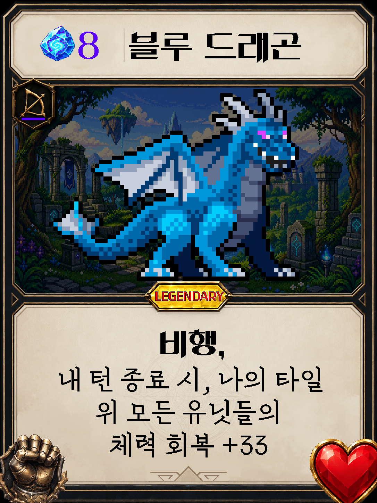
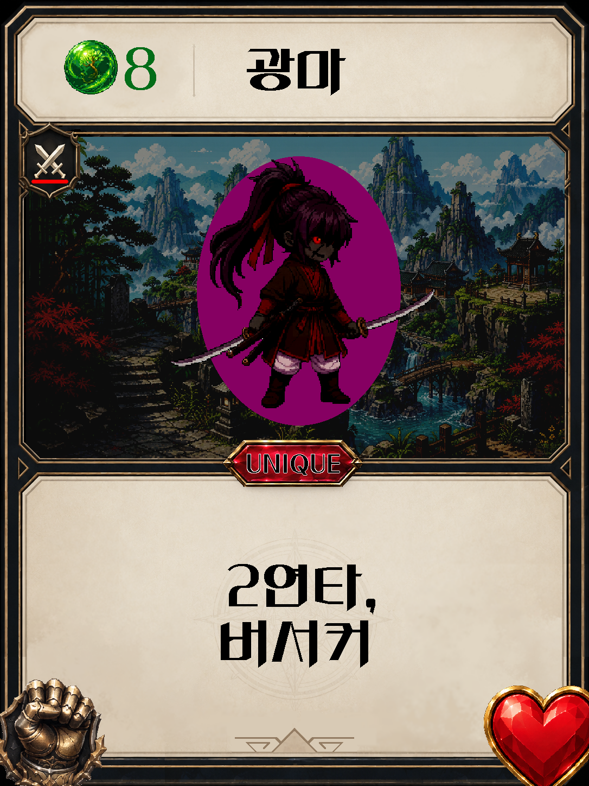
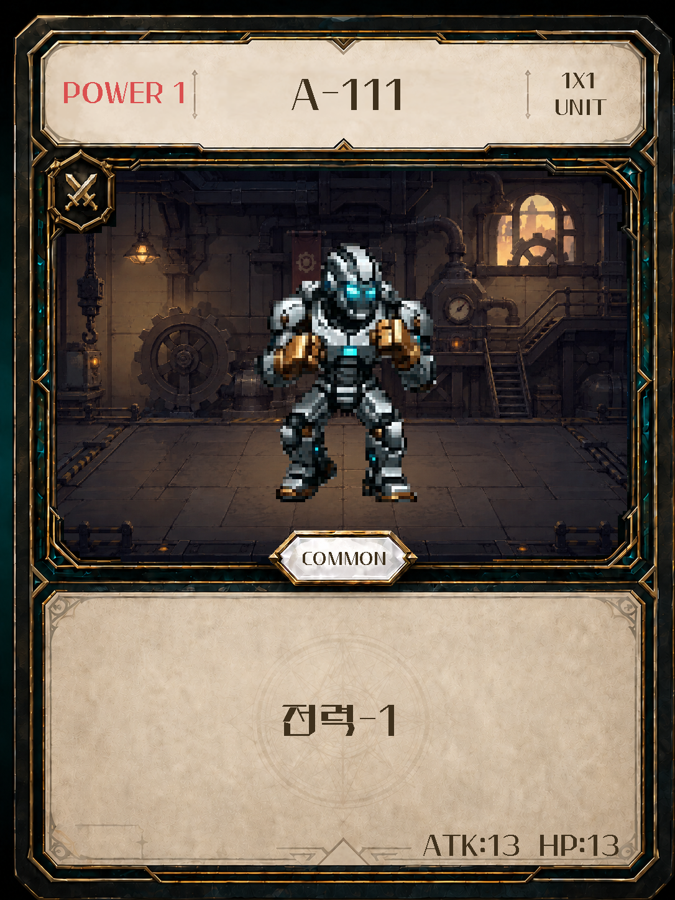
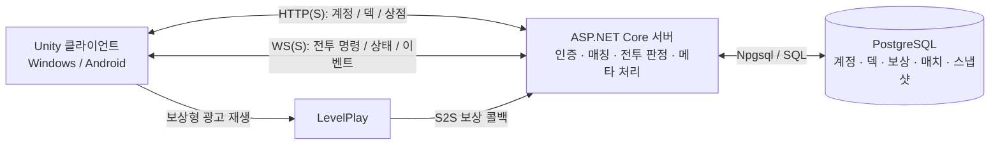

# After333

**33장의 덱으로, 3패 전에 33승에 도전하는 타일 기반 전략 카드 게임.**

After333는 판타지·무림·과학 문명의 카드를 조합해 싸우는 픽셀 아트 스타일의 턴제 카드 게임입니다. 각 플레이어의 5×2 전장에서 유닛과 건물을 배치하고, 마법과 자원을 활용해 상대 마스터를 쓰러뜨립니다.

Unity 클라이언트와 ASP.NET Core 서버, PostgreSQL로 구성되며, **전투 판정부터 덱 빌딩·보상·강화까지 서버가 검증하는 구조**로 개발하고 있습니다.

> 졸업작품으로 개발 중인 프로젝트입니다. 현재 개발·시연 대상은 Windows와 Android이며, 정식 출시 및 상시 운영을 보장하는 서비스는 아닙니다.

## 카드 아트

<p align="center">
  
  
  
</p>

카드 아트 예시입니다. 개발 중 밸런스와 이미지가 변경될 수 있으며, 실제 판정 수치는 카드 데이터와 전투 로직을 기준으로 합니다.

## 플레이 흐름

1. 게임 ID 또는 Google 계정으로 로그인합니다.
2. 티켓을 사용해 새로운 런을 시작합니다.
3. 매번 제시되는 카드 3장 중 1장을 골라 33장의 덱을 완성합니다.
4. 완성한 덱으로 AI 상대 PvE 또는 계정 매칭 기반 1:1 PvP를 진행합니다.
5. 33승 또는 3패에 도달하면 런이 종료되고 골드와 카드 보상을 받습니다.
6. 보유 카드와 골드로 카드를 강화하거나, 상점에서 다음 도전에 필요한 티켓을 준비합니다.

런은 하나의 덱으로 여러 전투를 이어가는 도전 단위입니다. 덱 빌딩 중에는 **선택한 카드와 현재 제시된 카드 3장 모두 저장**되므로 중단한 지점부터 이어서 진행할 수 있습니다.

## 주요 기능

| 구분 | 구현 내용 |
| --- | --- |
| 전투 | 5×2 타일 전장, 유닛·건물·마법, 이동과 위치 교환, 근거리·원거리 공격, 반격 |
| 피해 판정 | 물리·마법·고정 피해, 물리·마법 방어력, 다단히트 및 특수효과 상호작용 |
| 전투 시작 | 무작위 선공 결정, 덱 셔플, 33초 제한의 부분 멀리건 |
| PvE / PvP | 서버 AI와의 전투, 인증된 두 계정의 1:1 매칭과 전투 동기화 |
| 재접속 | 진행 중 PvP 조회, 연결 종료 후 60초 재접속 유예, 제한 시간 초과 시 결과 처리 |
| 계정 | 게임 ID 회원가입·로그인, Google 로그인, 세션·갱신 토큰 기반 자동 로그인, 로그아웃 |
| 덱 빌딩 | 서버에서 카드 오퍼 생성·선택 검증, 선택 내역 및 현재 오퍼 저장, 33장 완성 후 덱 고정 |
| 보상 | 런 종료 후 골드·카드 지급, 중복 수령 방지, 계정별 보유 내역 저장 |
| 카드 강화 | 동일 카드와 골드를 소모하는 최대 Lv.13 강화, 카드별 성장 규칙과 전투 수치 반영 |
| 상점 | 계정 골드를 사용한 티켓 구매, 보상형 광고 시청을 통한 티켓 획득 |
| 광고 보상 | LevelPlay S2S 콜백 검증 후 서버에서 지급, 콜백 재전송에 의한 중복 지급 방지 |
| 전투 UI | 반응형 보드·손패, 상대 손패·덱 수, 카드 공개 연출, 특수효과 툴팁, 스크롤 전투 기록 |
| 모바일 대응 | 가로 화면 UI, 뒤로가기 처리, 네트워크 변경 시 재접속 처리, Android 자격 증명 보관 |

Google 로그인과 실제 광고는 각 서비스의 프로젝트·키·콜백 설정이 필요합니다. 저장소를 복제하는 것만으로 외부 서비스까지 자동으로 활성화되지는 않습니다.

### 전투와 성장의 특징

- 전투 중에는 **마나·기·전력·골드**를 사용합니다. 골드는 부족한 다른 자원을 1:1로 대체할 수 있습니다.
- 전투용 골드와 **계정에 저장되는 메타 골드**는 별개의 자원입니다.
- 마스터는 기본 HP 333, ATK 3으로 시작하며, 다른 소환물처럼 전장 위에 배치됩니다.
- 속공, 복제, 쉴더, 흡혈, 관통, 봉인, 은신, 비행, 주문력, 무적 등 다양한 특수효과를 지원합니다.
- 강화 가능 여부와 덱 빌딩·보상 등장 여부는 카드별로 관리합니다.

상세한 판정과 비용은 [전투 규칙](docs/battle_rules.md), [드래프트 규칙](docs/draft_rules.md), [메타 규칙](docs/meta_rules.md)을 참고하세요.

## 시스템 구조



### 서버와 클라이언트의 역할

**클라이언트**는 카드 선택·소환·이동·공격·턴 종료 등의 의도를 명령으로 보내고, 서버가 내려준 상태를 UI·애니메이션·효과음으로 표현합니다. 전투 기록의 한국어 문장도 클라이언트에서 생성합니다.

**서버**는 명령의 합법성, 자원 비용, 피해·회복, 승패를 판정하고 `StateView`와 `BattleEvents`를 전달합니다. 상대 손패의 정체와 같은 비공개 정보는 플레이어별로 필터링합니다.

**PostgreSQL**에는 계정, 세션, 지갑, 카드 수량·강화 레벨, 드래프트 진행, 매치 상태, 전투 스냅샷 등을 저장합니다. 재접속용 구조화된 전투 기록은 최근 33줄을 복원할 수 있도록 관리합니다.

전투 규칙 코드는 Unity와 서버가 공유합니다. 로컬 전투 경로도 남아 있지만, 현재 계정 기반 게임 흐름은 서버와 DB가 필요합니다.

### 연결 환경

- 같은 PC에서 개발할 때는 `http://127.0.0.1:7333`과 `ws://127.0.0.1:7333/battle`을 사용합니다.
- 다른 기기에서 접속할 때는 해당 기기에서 접근 가능한 서버 주소를 사용해야 합니다. 휴대폰의 `127.0.0.1`은 서버 PC가 아니라 휴대폰 자신입니다.
- 외부 공개 환경은 **HTTPS와 WSS**를 사용하도록 구성합니다. 현재 개발용 노트북 서버를 외부에 연결하는 경로로 Cloudflare Tunnel을 사용하며, 터널은 게임 판정이나 DB 저장을 담당하지 않습니다.
- 실제 동시 접속 수용량은 서버 사양·네트워크·DB 및 부하 검사에 따라 달라집니다. 1:1은 한 매치의 인원이며 서버 전체 접속 인원 제한을 뜻하지 않습니다.

## 기술 스택

| 영역 | 사용 기술 |
| --- | --- |
| 클라이언트 | Unity 6 (`6000.3.12f1`), C#, Unity UI, TextMesh Pro |
| 서버 | .NET 8, ASP.NET Core, WebSocket |
| 데이터베이스 | PostgreSQL, Npgsql, SQL 마이그레이션 |
| 인증 | 게임 ID 인증, Google OAuth / OpenID Connect, 세션·갱신 토큰 |
| Android 연동 | Credential Manager, Android Keystore, IL2CPP / Gradle 빌드 |
| 광고 | Unity LevelPlay 보상형 광고, 서버 간 보상 콜백 |
| 검증·운영 | Unity Test Framework / NUnit, PowerShell 검사·실행 스크립트, 상태 확인 API와 로그 |

## 프로젝트 구조

```text
Assets/
  GameStart_VSlice.unity          시작 화면과 로그인
  DeckBuilding_VSlice.unity       33장 덱 빌딩
  Draft_VSlice.unity              런 진행, 전적, 전투 진입, 보상
  Battle_VSlice.unity             전투
  OwnedCards_VSlice.unity         보유 카드와 강화
  Shop_VSlice.unity               티켓 구매와 보상형 광고
  Project333/
    Runtime/
      Domain/                    전투 상태와 핵심 규칙
      Application/               명령, 서비스, 계정·온라인 통신
      Infrastructure/            카드 데이터와 외부 연동 기반
      Presentation/              씬, UI, 입력, 연출
    Resources/Project333/         카드 JSON, 이미지, UI 리소스
    ScriptableObjects/           Unity 카드 에셋
    Editor/                      에디터 도구와 씬 구성 도구
    Tests/EditMode/              자동화 테스트
Server/Project333.PvpServer/
  Auth/                          계정과 인증
  Matchmaking/                   PvP 매칭과 재접속
  BattleSessions/                서버 전투 세션
  BattlePersistence/             전투 스냅샷 저장
  Runs/                          런, 덱 빌딩, 보상
  Cards/                         카드 보유와 강화
  Ads/                           광고 보상 검증
  Persistence/Migrations/        DB 스키마 마이그레이션
  Tools/                         실행·점검·배포 보조 스크립트
docs/                            규칙, 설계, 설정 및 제작 가이드
```

공개 게임 이름은 **After333**입니다. 호환성을 위해 C# 네임스페이스, 폴더, 환경변수의 `Project333` / `PROJECT333_*` 명칭은 유지합니다.

## 로컬 실행

### 1. 개발 도구와 DB 준비

Unity Hub에서 **Unity `6000.3.12f1`**을 설치하고, .NET 8 SDK와 PostgreSQL을 준비합니다. Android 빌드에는 같은 Unity 버전의 Android Build Support, SDK/NDK, OpenJDK가 필요합니다.

```powershell
git clone https://github.com/imyjw/After333.git
cd After333
```

PostgreSQL에 개발용 데이터베이스 `project333`을 만들고, 해당 DB와 테이블을 생성·수정할 수 있는 로그인 계정을 준비합니다. 아래 예시는 DB 계정 이름도 `project333`인 경우입니다. 다른 계정을 만들었다면 입력 값을 변경하세요.

### 2. 서버 실행

저장소 루트의 PowerShell에서 실행합니다. DB 비밀번호는 코드에 적지 않고 자격 증명 입력창에서 입력합니다.

```powershell
$dbCredential = Get-Credential -UserName 'project333' -Message '개발용 PostgreSQL 계정 입력'
$connection = New-Object System.Data.Common.DbConnectionStringBuilder
$connection.Add('Host', '127.0.0.1')
$connection.Add('Port', '5432')
$connection.Add('Database', 'project333')
$connection.Add('Username', $dbCredential.UserName)
$connection.Add('Password', $dbCredential.GetNetworkCredential().Password)
$env:PROJECT333_DB_CONNECTION = $connection.get_ConnectionString()
$projectPath = (Resolve-Path '.\Server\Project333.PvpServer\Project333.PvpServer.csproj').Path

powershell -NoProfile -ExecutionPolicy Bypass -File .\Server\Project333.PvpServer\Tools\RunServer_Local.ps1 -ProjectPath $projectPath
```

이 실행 스크립트는 **로컬 개발용**입니다. 개발용 티켓 보정 등의 설정이 포함되므로 공개 운영 설정과 구분해서 사용하세요. DB 연결 문자열은 서버 프로세스에 전달되므로 콘솔 출력·스크린샷·커밋에 포함하지 마세요.

서버는 시작할 때 미적용 SQL 마이그레이션을 실행합니다. 데이터베이스 자체는 먼저 만들어야 하며, 중요한 기존 DB에는 실행 전 백업을 권장합니다.

다른 PowerShell 창에서 상태를 확인할 수 있습니다.

```powershell
Invoke-RestMethod 'http://127.0.0.1:7333/health'
Invoke-RestMethod 'http://127.0.0.1:7333/server/status'
```

`/health`는 서버 응답 여부를 확인합니다. 계정 기반 플레이에는 `/server/status`의 DB·카드 데이터 상태도 정상이어야 합니다.

### 3. Unity 클라이언트 실행

1. Unity Hub에서 복제한 저장소 루트를 프로젝트로 추가하고, 패키지와 에셋 임포트가 끝날 때까지 기다립니다.
2. `Assets/GameStart_VSlice.unity`를 엽니다.
3. Play 모드에서 `ServerSettingsPanel`의 서버 주소를 `http://127.0.0.1:7333`으로 설정하고 적용합니다.
4. 게임 ID로 회원가입·로그인한 뒤 플레이합니다. 현재 게임 흐름은 로그인 없이 시작할 수 없습니다.

PvP는 **서로 다른 두 계정과 두 클라이언트**로 확인합니다. Unity Editor와 Windows 실행 파일을 함께 사용하거나, 다른 PC·Android 기기를 연결할 수 있습니다. 다른 기기는 로컬 전용 실행 설정 대신 LAN 또는 HTTPS 서버 설정이 필요합니다.

Google 로그인은 [Google 인증 설정](docs/google_auth_setup.md), 실제 광고는 [보상형 광고 설정](docs/rewarded_ads.md), 다른 PC 연결은 [LAN 시연 가이드](docs/lan_pvp_demo_checklist.md)를 참고하세요.

## 테스트와 카드 제작

Unity의 **Window > General > Test Runner > EditMode > Run All**에서 규칙 및 회귀 테스트를 실행합니다. 카드 데이터는 **Tools > Project333 > Data > Validate cards.json**에서 검증할 수 있습니다.

서버 컴파일은 저장소 루트에서 다음 명령으로 확인합니다.

```powershell
dotnet build .\Server\Project333.PvpServer\Project333.PvpServer.csproj
```

카드 데이터의 기준 파일은 [cards.json](Assets/Project333/Resources/Project333/Data/cards.json)입니다. 카드 추가·수정 시에는 데이터뿐 아니라 실제 효과 처리, Unity 에셋, 툴팁, 온라인 동기화, 테스트를 함께 확인합니다.

```json
{
  "includeInDraft": false,
  "includeInRewards": false
}
```

위 값은 카드 데이터 중 등장 여부를 제어하는 일부 필드입니다. 이미지 제작 전 카드는 등장하지 않게 두고, 준비가 끝난 뒤 각 값을 `true`로 변경할 수 있습니다. 강화 불가 카드처럼 보상 대상에서 제외되는 규칙은 별도로 적용됩니다.

전체 제작 절차는 [카드 제작 체크리스트](docs/card_authoring_checklist.md), 카드별 정보는 [카드 목록](docs/card_catalog.md)을 참고하세요.

## 문서

| 주제 | 문서 |
| --- | --- |
| 게임 개요 | [게임 설계](docs/game_design.md) |
| 전투 판정 | [전투 규칙](docs/battle_rules.md) |
| 덱 빌딩 | [드래프트 규칙](docs/draft_rules.md) |
| 보상·강화·티켓 | [메타 규칙](docs/meta_rules.md) |
| 계정과 DB | [계정 영속화 설계](docs/account_persistence_db_design.md) |
| 서버 실행·운영 | [서버 README](Server/Project333.PvpServer/README.md) |
| 외부 접속 | [HTTPS / WSS 설정](docs/https_wss_reverse_proxy_setup.md) |
| 배포 점검 | [배포 준비 체크리스트](docs/deployment_readiness_checklist.md) |
| 모바일 인증 정보 | [안전한 자격 증명 저장](docs/mobile_secure_credential_storage.md) |

세부 문서에는 초기 설계와 이후 구현 내용이 함께 남아 있는 부분이 있습니다. 현재 동작 확인에는 해당 코드와 최신 테스트도 함께 참고하세요.

## 개발 상태와 주의사항

핵심 플레이 및 계정 기반 메타 흐름을 구현한 상태이며, 카드 추가·밸런스 조정·UI 개선·실기기 검증을 계속 진행하고 있습니다. 랭크/MMR, 시즌, 유료 결제, 정식 운영 인프라는 현재 README에서 완료 기능으로 다루지 않습니다.

DB 비밀번호, Google Client Secret, 광고 S2S private key, 세션 토큰, 서명용 키스토어는 저장소에 올리지 마세요. 각 외부 서비스와 포함 에셋의 이용 조건은 별도로 확인해야 하며, 저장소 공개 여부만으로 모든 코드·이미지·폰트의 재배포 허가가 주어지는 것은 아닙니다.
