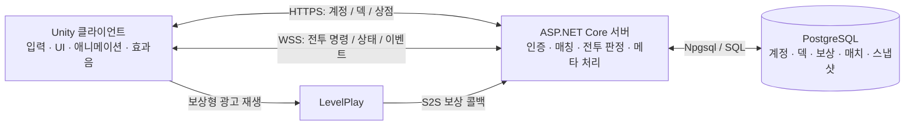

# After333


**덱 빌딩의 선택과 타일 배치의 전략을 결합한 턴제 카드 게임**

After333는 판타지·무림·과학 문명의 카드를 조합해 33장의 덱을 만들고, 각 플레이어의 5×2 전장에서 대결하는 게임입니다. 카드의 성능뿐 아니라 전열·후열 배치, 자원 운용, 행동 순서가 승패에 영향을 줍니다.

졸업작품으로 개발 중이며, **Unity 기반 전투 프로토타입을 계정·매칭·재접속·메타 성장이 연결된 서버 권위형 게임으로 확장**하는 데 중점을 두었습니다.

| 항목 | 내용 |
| --- | --- |
| 장르 | 타일 기반 턴제 전략 카드 게임 |
| 플랫폼 | Windows · Android, 가로 화면 |
| 플레이 모드 | 서버 AI 상대 PvE · 계정 매칭 기반 1:1 PvP |
| 핵심 목표 | 하나의 덱으로 3패 전에 33승 달성 |
| 주요 구현 범위 | 전투 시스템, 온라인 동기화, 계정·DB, 덱 빌딩, 보상·강화·상점, 모바일 UI |

## 카드 비주얼

<p align="center">
  
  
  
</p>

판타지·무림·과학 문명을 표현한 카드 아트 예시입니다.

## 게임 플레이

```text
로그인 → 3장 중 1장씩 선택해 33장 덱 구성 → PvE / PvP 반복 전투
                                    → 33승 또는 3패로 런 종료
                                    → 보상 수령 → 카드 강화 · 다음 도전
```

런은 하나의 덱으로 여러 전투를 이어가는 도전 단위입니다. 전투 밖에서 획득한 카드와 골드는 계정에 누적되며, 다음 도전을 위한 성장으로 연결됩니다.

| 시스템 | 플레이 경험 |
| --- | --- |
| 전장과 자원 | 유닛·건물·마법을 활용한 5×2 타일 전투, 마나·기·전력·골드 운용 |
| 공격과 특수효과 | 근거리·원거리, 반격, 물리·마법·고정 피해, 방어력과 다양한 특수효과의 조합 |
| 덱 빌딩 | 매 선택마다 제시되는 카드 3장 중 1장 선택, 중단한 덱 구성 이어하기 |
| 온라인 전투 | 1:1 계정 매칭, 서버 AI 대전, 연결 종료 후 진행 중 PvP 재접속 |
| 메타 성장 | 런 종료 보상, 동일 카드와 골드를 사용하는 최대 Lv.13 강화 |
| 상점과 광고 | 계정 골드로 티켓 구매, 보상형 광고 시청 후 티켓 획득 |

## 기술 스택

| 영역 | 기술 |
| --- | --- |
| 게임 클라이언트 | Unity 6 · C# · Unity UI · TextMesh Pro |
| 게임 서버 | ASP.NET Core · .NET 8 · WebSocket |
| 데이터 저장 | PostgreSQL · Npgsql · SQL 마이그레이션 |
| 계정 인증 | 게임 ID 인증 · Google OAuth / OpenID Connect · 세션·갱신 토큰 |
| 모바일 연동 | Android Credential Manager · Android Keystore · IL2CPP |
| 광고 | Unity LevelPlay · 서버 간 보상 검증 콜백 |
| 테스트 | Unity Test Framework · NUnit · 서버 시나리오 검증 스크립트 |

## 아키텍처



**입력과 표현은 클라이언트, 게임 판정과 영속 데이터는 서버**가 담당합니다. Unity와 서버가 핵심 전투 규칙 코드를 공유하며, `Domain`, `Application`, `Infrastructure`, `Presentation`으로 역할을 나누었습니다.

## 핵심 구현

### 1. 로컬 전투에서 서버 권위형 PvP로 전환

**문제 인식:** 각 클라이언트가 전투를 계산하면 서로 다른 결과가 발생할 수 있고, 조작된 요청이나 재접속 상황에서 신뢰할 상태의 기준이 불명확해집니다.

소환·이동·공격·마법 사용을 명령으로 분리하고, 서버에서 행동 가능 여부와 비용을 검증한 뒤 전투 상태를 변경하도록 구성했습니다. 클라이언트는 `StateView`와 `BattleEvents`를 받아 화면을 갱신하며, 상대 손패는 카드 정체를 제외한 장수만 전달합니다.

`IBattleGateway`로 화면과 전투 처리 경계를 분리해 로컬·온라인 처리 경로를 구분했습니다. 전투 규칙을 공유하되, 온라인에서는 서버 결과를 기준으로 표현하도록 설계했습니다.

관련 코드: [전투 Gateway](Assets/Project333/Runtime/Application/Gateways/IBattleGateway.cs) · [서버 전투 세션](Server/Project333.PvpServer/BattleSessions/BattleSession.cs) · [플레이어별 상태 생성](Assets/Project333/Runtime/Application/Online/BattleStateViewFactory.cs)

### 2. 중단 후에도 유지되는 전투와 덱 빌딩

**문제 인식:** 앱 종료나 모바일 네트워크 변경 이후에도 같은 계정의 진행 상태를 복원해야 합니다. 선택한 카드만 저장하면 재접속 때 제시 카드가 바뀌는 문제도 생깁니다.

서버에서 덱 빌딩 후보를 생성하고, 선택한 카드와 현재 제시 카드 3장을 함께 저장했습니다. 카드 선택 순번과 후보를 검증하고 선택 결과·다음 후보를 하나의 트랜잭션으로 반영해, 중단 이후에도 같은 선택 지점으로 돌아오도록 구성했습니다.

PvP는 계정·매치·플레이어 자리 정보를 연결하고, 연결 종료 후 60초의 재접속 유예를 적용했습니다. 전투 스냅샷과 남은 상태 정보를 복원하며, 이미 종료된 전투는 재접속 대신 결과를 안내합니다.

관련 코드: [오퍼 생성](Server/Project333.PvpServer/Runs/ServerDraftOfferGenerator.cs) · [런 진행 저장](Server/Project333.PvpServer/Runs/RunStartService.cs) · [매칭·재접속](Server/Project333.PvpServer/Matchmaking/PvpMatchmakingService.cs) · [스냅샷 저장](Server/Project333.PvpServer/BattlePersistence)

### 3. 보상·강화·광고의 데이터 정합성

**문제 인식:** 중복 클릭, 요청 재시도, 광고 콜백 재전송이 발생해도 재화가 중복 지급되거나 강화 비용만 차감되어서는 안 됩니다.

카드 강화는 서버에서 보유 수량·현재 레벨·비용을 검증하고, 골드 및 카드 소모와 레벨 변경을 DB 트랜잭션으로 처리합니다. 런 종료 보상 역시 계정의 서버 저장 상태를 기준으로 수령 여부를 관리합니다.

광고 SDK의 클라이언트 완료 이벤트를 지급 근거로 사용하지 않고, **LevelPlay의 서버 간 콜백 서명을 검증한 뒤** 티켓을 지급합니다. 광고 이벤트 ID와 보상 시도 상태를 저장해 같은 콜백이 다시 와도 지급 결과가 중복되지 않도록 구성했습니다.

관련 코드: [카드 강화](Server/Project333.PvpServer/Cards/CardUpgradeService.cs) · [광고 보상 검증](Server/Project333.PvpServer/Ads/RewardedAdService.cs) · [DB 스키마](Server/Project333.PvpServer/Persistence/Migrations)

### 4. 카드 확장을 고려한 규칙과 검증

**문제 인식:** 카드와 특수효과가 늘어날수록 개별 기능보다 효과끼리 충돌하는 경계 조건이 중요해집니다.

카드 정의는 JSON 데이터와 Unity 에셋으로 관리하고, 공격·피해·턴 진행·마법 처리를 서비스로 분리했습니다. 피해 속성별 방어력, 다단히트, 쉴더, 불굴, 봉인, 무적 등의 상호작용을 공통 규칙과 회귀 테스트로 검증합니다.

카드 데이터 Validator로 잘못된 정의를 확인하고, 기능 개발과 실제 카드 공개를 분리할 수 있도록 덱 빌딩·보상 등장 여부를 카드별로 관리합니다.

관련 코드: [카드 데이터](Assets/Project333/Resources/Project333/Data/cards.json) · [전투 서비스](Assets/Project333/Runtime/Application/Services) · [데이터 검증](Assets/Project333/Runtime/Infrastructure/Data/CardDatabaseValidator.cs)

### 5. 해상도 대응과 전투 정보 표현

**문제 인식:** PC와 모바일의 화면 비율이 달라지면 타일·소환물·스탯·연출 위치가 어긋나고, 네트워크 상태를 그대로 표시하는 것만으로는 전투 과정을 이해하기 어렵습니다.

보드와 UI를 화면 크기에 맞춰 배치하고, 카드의 ATK/HP 숫자는 UI 사각형이 아닌 **실제로 표시되는 이미지 영역의 정규화 좌표**를 기준으로 배치했습니다. 이미지 비율을 유지하면서 남는 여백 때문에 숫자가 어긋나는 문제를 처리한 방식입니다.

전투 기록은 서버에 구조화된 사건을 저장하고, 클라이언트에서 한국어 문장으로 변환합니다. 최근 33줄을 재접속 시 복원하며, 상대 카드 공개 연출·특수효과 툴팁·드로우 효과음으로 판정 결과를 전달합니다.

관련 코드: [반응형 보드](Assets/Project333/Runtime/Presentation/Battle/BoardPresenter.cs) · [카드 스탯 좌표 계산](Assets/Project333/Runtime/Presentation/Hand/HandCardStatOverlayLayout.cs) · [구조화된 전투 기록](Assets/Project333/Runtime/Application/Online/BattleCombatLogEntryDto.cs) · [기록 문장 생성](Assets/Project333/Runtime/Application/Services/CombatLogFormatter.cs)

## 검증 방식

기능이 동작하는 경우뿐 아니라 **실패·재시도·상태 전환 시에도 규칙이 유지되는지**를 중심으로 검증합니다.

| 검증 대상 | 주요 확인 내용 |
| --- | --- |
| 전투 규칙 | 공격·반격, 방어력, 다단히트, 사망과 승패, 특수효과 간 상호작용 |
| 온라인 상태 | 플레이어 관점 변환, 비공개 손패 정보, 전투 상태 복원 |
| 계정과 메타 | 자동 로그인, 덱 빌딩 복원, 보상 중복 수령 방지, 강화 비용과 레벨 반영 |
| 화면 표현 | 서로 다른 화면 비율에서 카드 스탯 위치 및 크기 계산 |

테스트 코드: [EditMode 테스트](Assets/Project333/Tests/EditMode) · [피해 판정 테스트](Assets/Project333/Tests/EditMode/DamageTypeResolutionTests.cs) · [온라인 상태 복원 테스트](Assets/Project333/Tests/EditMode/BattleStateViewProjectorTests.cs) · [카드 스탯 배치 테스트](Assets/Project333/Tests/EditMode/HandCardStatOverlayLayoutTests.cs)

## 현재 개발 범위

전투 씬


보유 카드 씬


상점 씬

계정 로그인부터 덱 빌딩, PvE/PvP 전투, 결과 저장, 보상 수령, 카드 강화와 상점까지 연결된 플레이 흐름을 구현했습니다. 현재는 카드 콘텐츠·밸런스·AI 행동과 모바일 사용성을 지속적으로 개선하고 있습니다.

