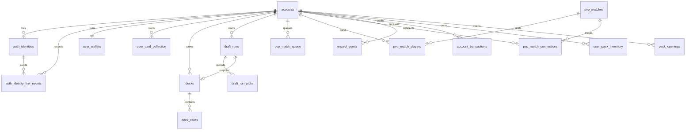

# Account Persistence DB Design

## Document Purpose

This document defines the database design for accounts, login identities, owned card copies, card upgrade levels, drafted run decks, run progress, reward history, and account-backed PvP reconnection.

This is an implementation contract for server-owned account data. Battle rules still live in the battle-rule documents; account progression and login state must stay behind the server API/DB layer.

Related documents:

- Battle rules: [battle_rules.md](./battle_rules.md)
- Draft rules: [draft_rules.md](./draft_rules.md)
- Meta rules: [meta_rules.md](./meta_rules.md)
- Online PvP prototype: [online_pvp_prototype.md](./online_pvp_prototype.md)
- PostgreSQL implementation plan: [postgresql_db_implementation_plan.md](./postgresql_db_implementation_plan.md)

## Confirmed Product Direction

Confirmed design direction:

- Login supports first-party Game ID login.
- Social login targets are Naver, Kakao, and Google.
- Google login is implemented; Naver and Kakao remain future targets.
- Guest account creation and authentication are disabled.
- The game requires a valid Game ID or social-login account before any game feature can be used.
- User-facing identity linking, logout, and account switching are not part of the current product flow.
- Account and meta progression are designed for an actual server DB, not client-local authoritative storage.
- Local data is only temporary cache or demo data unless a later rule says otherwise.
- Static card definitions stay outside user rows.
- User card ownership is stored as card copies plus an upgrade level.
- Card upgrades are similar to Clash Royale style progression.
- Upgrade costs consume owned copies of that same card plus an out-of-battle currency.
- A drafted deck is used until that run reaches either 33 wins or 3 losses.
- A run deck stores card ids only; each battle applies the account's current upgrade level for those cards.
- PvE and PvP can use the same persisted deck/run schema.
- PvE is primarily for feature demonstration at this stage.
- Rewards are granted at run end, not after every battle.
- Rewards will likely include packs.
- Future card acquisition routes may include packs, shop, rewards, and crafting.
- Tickets are spent when starting a new run.
- PvP matchmaking and reconnect must use authenticated server accounts, not local-only player names.
- A reconnecting client must prove account identity with a valid `sessionToken` or a freshly restored session.
- Each started battle retains a server-owned participant snapshot containing account, runtime/online seat, run, deck contents and upgrade levels. Reconnect requests restore these values; they cannot replace them or attach a run to a practice battle.
- Participant snapshots persist separately from live connections, including when all participants disconnect. Recovery restores participant metadata before constructing upgrade providers. Legacy snapshots may use identities from their server-saved connections; a missing historical participant cannot be reconstructed from new client input, so that seat's recovery is rejected.
- Started `pvp_match_players` entries reject changes to account, run, deck or runtime seat. Run-result updates also require the bound account to own the run and the completed deck to match.
- Migration `0012_battle_result_receipts` adds `battle_result_receipts` (result UUID primary key, match ID, complete server result JSON, recorded timestamp) and `battle_run_results` (result UUID + seat primary key, account/run/deck and win flag). The receipt and all run/match updates share one transaction. Duplicate identical delivery succeeds without another increment; conflicting reuse of an ID is rejected.
- BattleSession generates its result UUID independently of the client-visible room name and persists it in snapshots. Result extraction is non-destructive. Legacy active snapshots derive a stable server-side identity; legacy ended snapshots without result identity are not automatically replayed because prior application cannot be proven.
- Before a terminal response, BattleSession writes its immutable result to the server result outbox using a flushed temporary file and atomic rename. The hosted worker retries pending files after DB recovery and loads them again on restart. Files are removed only after DB commit; replay after an uncertain commit is safe because of the receipt.
- `PROJECT333_BATTLE_RESULT_OUTBOX_DIR` may select a persistent private server directory. The default is `LocalApplicationData/After333/Server/BattleResults/<database fingerprint>`; the fingerprint uses host, port, database and username, excluding credentials. Keep the directory across releases and back it up with server state. It is server-owned data, never a client upload directory.
- Malformed, conflicting or permanently rejected results are retained and logged for investigation. Retry delays grow from 5 to 60 seconds. This does not recover a terminal result that was never durably written, nor protect against simultaneous loss of the DB and server outbox disk.

## Scope

This document is a design contract.

Current implementation target:

- mandatory Game ID or Google login
- automatic restoration through session and refresh tokens
- Game ID login/register support
- social-login-ready identity storage for Google, Kakao, and Naver
- account-backed draft/run/reward/card-upgrade persistence
- account-backed PvP matchmaking/reconnect storage

Still deferred unless explicitly requested:

- production OAuth provider integration
- paid shop or real-money purchase flows
- full pack-opening UX
- crafting

## High-Level Storage Rule

Card definitions and user ownership are separate.

- Static card data stays in `cards.json` or a future server-side card-definition table.
- User-specific data goes into the database.
- A user's collection stores `card_id` references, not copied card definitions.
- A user's collection stores copy count and upgrade level per `card_id`.
- Drafted run decks store the selected card ids for the run.
- Live battle command execution uses the in-memory server `BattleSession`.
- PvP snapshots and accepted/rejected command-log rows are persisted for account-based reconnect and optional server-startup recovery.

## Server DB Direction

The target architecture uses an actual server DB.

Recommended DB:

- PostgreSQL

The Unity client must not be the authoritative owner of account progression, card collection, upgrades, tickets, rewards, or run results.

For local development, the backend server and PostgreSQL can still run on the developer machine. The important rule is that persistence flows through the server layer instead of Unity writing authoritative progression directly.

Advantages:

- Server can validate account ownership, rewards, tickets, and upgrades.
- Works with real login.
- Works across devices.
- Safer against cheating.
- Better fit for PvP matchmaking, rewards, packs, shop, and future live features.

Limitations:

- Requires backend hosting or a local backend process during development.
- Requires migrations and operational discipline.
- Requires PostgreSQL setup for realistic persistence tests.

Best use:

- Real account persistence.
- PvP-linked progression.
- Reward and economy systems.
- Any data that should not be trusted from the client.

### Non-Authoritative Local Cache

Local files or local SQLite may still be used only as a non-authoritative cache.

Allowed uses:

- Remembering the last used guest token or refresh token.
- Caching account/profile data for UI startup.
- Caching card images or static data.
- Temporary demo-only data when the backend is not being used.

Not allowed as authoritative data:

- Card ownership.
- Card upgrade levels.
- Resource Gold.
- Tickets.
- Run wins/losses.
- Run-end rewards.
- Pack contents.

## Offline Play Data

"Offline play data" means progression data created while the game is not connected to the server.

Examples:

- A local guest profile stored only on the device.
- A locally drafted deck that the server never saw.
- Local battle results.
- Local card rewards.
- Local card upgrade changes.

This matters because later online systems need to decide whether that local data can be trusted.

Recommended rule:

- Guest accounts are server accounts.
- Local offline data should be treated as cache or temporary demo data.
- Local offline rewards, local card ownership changes, and local ticket changes are not merged into real online accounts.
- If true offline progression is added later, it needs a separate explicit merge policy before it can affect server accounts.

## Core Concepts

### Account

An account represents one real user.

The account owns:

- profile data
- linked login identities
- Resource Gold balance
- ticket balance
- card collection
- card upgrade levels
- saved/deployed run decks
- current run state
- reward history

### Auth Identity

An auth identity is one login method attached to an account.

Confirmed provider targets:

- `game_id`
- `guest`
- `naver`
- `kakao`
- `google`

One account can have multiple auth identities. For example, a user can start as a guest account and later link Google login to the same account.

Guest account rule:

- Guest login creates or resumes a real server-side account.
- The client may cache the guest token locally, but the account state lives on the server.
- Linking Game ID or social login upgrades the same account instead of creating a separate account.

Identity normalization rule:

- `provider_user_id` stores the original provider id or hashed credential id.
- `normalized_provider_user_id` stores the lookup key used for uniqueness.
- For `game_id`, the normalized id is lower-case and trimmed so login is case-insensitive.
- For `guest` and social providers, preserve the provider id unless that provider's official rules say otherwise.
- Only active identities must be unique by `(provider, normalized_provider_user_id)`.

Game ID policy v1:

- `gameId` is 3-32 characters.
- Allowed characters are English letters, numbers, `_`, and `-`.
- Login is case-insensitive through `normalized_provider_user_id`.
- `password` is 8-128 characters.
- Store only password hashes, never raw passwords.

### Auth Session

An auth session is a temporary API login session for one account.

The account system uses three different token concepts:

- `guestToken`: a stable guest-account resume credential.
- `sessionToken`: a short-lived API credential used in `Authorization: Bearer ...`.
- `refreshToken`: a longer-lived device login credential used only to rotate a new token pair.

Rules:

- The server may return raw tokens to Unity when login succeeds.
- The database should store only token hashes.
- Unity must store `guestToken`, `sessionToken`, and `refreshToken` through the account credential-store boundary.
- Android player builds use an Android Keystore AES-GCM key and keep only encrypted payloads in app-private preferences.
- iOS player builds use Keychain generic-password entries with `AfterFirstUnlockThisDeviceOnly` accessibility.
- Unity Editor and the current Windows development build use scoped `PlayerPrefs` only as development storage; this is not the mobile release security model.
- On the first mobile launch after upgrading from an older build, a legacy scoped `PlayerPrefs` credential is copied to secure storage and deleted only after the secure write succeeds.
- A `sessionToken` is valid only while its session row is not revoked and not expired.
- A `refreshToken` is stored only as a hash in `auth_refresh_tokens` and is rotated on every successful refresh.
- Reusing an already rotated refresh token revokes its token family and requires an explicit login.
- Logging out revokes the current session and its refresh token before Unity clears local credentials.
- Logging in again can create a new session without changing the account.
- Guest-to-Game-ID or guest-to-social linking should keep the same `account_id` and can revoke or preserve existing sessions based on later security rules.

### Card Definition

A card definition is the canonical game data for a card.

Examples:

- `Goblin`
- `firebolt`
- `Cerberus`
- `BlueDragon`

For now, the canonical card definition source remains `cards.json`.

The DB references card definitions by stable `card_id`.

### Account Card Progress

Account card progress stores a user's ownership and upgrade state for one card type.

This is one row per account plus card id:

- `account_id`
- `card_id`
- `copy_count`
- `upgrade_level`

This matches the intended Clash Royale-like model:

- Rewards grant extra copies of a card.
- Upgrading that card consumes copies of that card plus currency.
- The card's level increases for that user's account.
- Leftover copies remain after the upgrade.

Example with only card-copy cost considered:

- If level 1 requires 13 copies, owning 13 Red Dragon copies allows level 0 to level 1 and leaves 0 copies.
- If level 1 requires 13 copies, owning 22 Goblin copies allows level 0 to level 1 and leaves 9 copies.
- If level 1 requires 13 copies and level 2 requires 23 copies, owning 38 Elf Longbow Scout copies allows level 0 to level 2 and leaves 2 copies.

### Deck

A deck is a list of card ids.

Confirmed run deck rule:

- A drafted deck contains 33 cards.
- A drafted deck is used until the run ends at 33 wins or 3 losses.
- The drafted deck is not a permanent constructed deck by default.

PvE and PvP can share the same deck schema.

### Run

A run is the full-game sequence described by [meta_rules.md](./meta_rules.md):

1. Spend ticket cost to start.
2. Draft one 33-card deck.
3. Fight repeated battles with that deck.
4. End at 33 wins or 3 losses.
5. Receive run-end rewards.

## Entity Relationship Overview

## Table Design

### `accounts`

Stores one row per user.

Suggested fields:

| Field | Type | Notes |
| --- | --- | --- |
| `id` | UUID | Primary key |
| `display_name` | text | Shown in UI |
| `account_kind` | text | `guest`, `registered` |
| `created_at` | timestamp | Server time |
| `updated_at` | timestamp | Server time |
| `last_login_at` | timestamp nullable | Updated on login |
| `is_banned` | boolean | Default false |
| `account_status` | text | `active`, `disabled`, `deleted` |

Notes:

- Do not use display name as identity.
- Do not expose internal account ids unnecessarily to other players.
- A guest account can become registered when it links Game ID or social login.

### `auth_identities`

Stores login providers connected to an account.

Suggested fields:

| Field | Type | Notes |
| --- | --- | --- |
| `id` | UUID | Primary key |
| `account_id` | UUID | FK to `accounts.id` |
| `provider` | text | `game_id`, `guest`, `naver`, `kakao`, `google` |
| `provider_user_id` | text | Unique id from provider |
| `normalized_provider_user_id` | text | Canonical lookup id; lower-case for `game_id` |
| `email` | text nullable | If available |
| `password_hash` | text nullable | Only for Game ID password login |
| `password_algorithm` | text nullable | Example: `pbkdf2-sha256`, `argon2id`, or `bcrypt` |
| `password_updated_at` | timestamp nullable | Updated when Game ID password changes |
| `email_verified_at` | timestamp nullable | Set when email verification is confirmed |
| `identity_status` | text | `active`, `revoked` |
| `linked_at` | timestamp | When the identity was linked to the account |
| `revoked_at` | timestamp nullable | When this login method was unlinked/revoked |
| `external_profile` | jsonb | Provider-specific non-authoritative profile payload |
| `updated_at` | timestamp | Server time |
| `created_at` | timestamp | Server time |
| `last_used_at` | timestamp nullable | Updated on login |

Constraints:

- Active identities are unique by `(provider, normalized_provider_user_id)`.
- If password login is used, never store raw passwords.
- Use a modern password hash such as Argon2id or bcrypt.
- `password_hash` and `password_algorithm` are required only for `game_id`.
- Social providers should use provider-subject ids, not display names, as `provider_user_id`.

Notes:

- Guest login should still create a real server-side account row.
- Social login links should attach to the same account, not create duplicates, when the user intentionally links them.
- A revoked identity remains as audit/history, but it must not allow login.

### `auth_identity_link_events`

Stores audit rows for identity lifecycle events.

Suggested fields:

| Field | Type | Notes |
| --- | --- | --- |
| `id` | UUID | Primary key |
| `account_id` | UUID | Account affected by the event |
| `auth_identity_id` | UUID nullable | Linked identity if available |
| `provider` | text | `game_id`, `guest`, `naver`, `kakao`, `google` |
| `event_type` | text | `created`, `linked`, `unlinked`, `login`, `password_changed` |
| `previous_account_id` | UUID nullable | Used when resolving merge/link conflicts |
| `created_at` | timestamp | Server time |
| `metadata` | jsonb | Debug/audit payload; never store raw passwords/tokens |

Rules:

- Use this table to debug account-linking problems without trusting Unity logs.
- Do not store raw `guestToken`, raw `sessionToken`, raw OAuth access token, or raw password.

### `user_wallets`

Stores account-level currencies.

Suggested fields:

| Field | Type | Notes |
| --- | --- | --- |
| `account_id` | UUID | Primary key and FK to `accounts.id` |
| `resource_gold` | bigint | Out-of-battle Resource Gold |
| `tickets` | integer | Tickets used to start runs |
| `updated_at` | timestamp | Server time |

Notes:

- Battle gold is not Resource Gold.
- Battle resources should not be stored in this table.
- Currency changes should also create an `account_transactions` audit row.

### `user_card_collection`

Stores what cards a user owns and their upgrade state.

Suggested fields:

| Field | Type | Notes |
| --- | --- | --- |
| `account_id` | UUID | FK to `accounts.id` |
| `card_id` | text | Stable id from card definition source |
| `copy_count` | integer | Remaining owned copies after upgrades |
| `upgrade_level` | integer | Current upgrade level |
| `created_at` | timestamp | First acquisition time |
| `updated_at` | timestamp | Last change time |

Primary key:

- `(account_id, card_id)`

Rules:

- `copy_count` cannot be negative.
- `upgrade_level` cannot be negative.
- Upgrading consumes copies from the same `card_id`.
- Upgrading also consumes the required currency from `user_wallets`.

### `card_upgrade_costs`

Stores card upgrade requirements if costs are managed by the server DB.

This table can also remain in a server config file if preferred.

Suggested fields:

| Field | Type | Notes |
| --- | --- | --- |
| `level_from` | integer | Current level before upgrade |
| `level_to` | integer | New level after upgrade |
| `required_copy_count` | integer | Card copies consumed |
| `required_resource_gold` | bigint | Resource Gold consumed |

Primary key:

- `(level_from, level_to)`

Open decision:

- Whether all cards share one upgrade cost table.
- Whether rarity changes upgrade cost.
- Maximum upgrade level.
- Exact stat/effect scaling per level.

### `decks`

Stores deck headers.

Suggested fields:

| Field | Type | Notes |
| --- | --- | --- |
| `id` | UUID | Primary key |
| `account_id` | UUID | FK to `accounts.id` |
| `name` | text | User-facing deck name |
| `deck_type` | text | `draft_run`, `pve`, `pvp`, `constructed` |
| `source_run_id` | UUID nullable | FK to `draft_runs.id` when created by draft |
| `card_definition_version` | text | Version/hash of card data used |
| `created_at` | timestamp | Server time |
| `updated_at` | timestamp | Server time |
| `is_archived` | boolean | Soft hide instead of hard delete |

Notes:

- Draft run decks should be immutable after draft completion.
- PvE and PvP can both point at the same `draft_run` deck.
- Constructed decks can be added later if constructed play is added.

### `deck_cards`

Stores the cards inside a deck.

Suggested fields:

| Field | Type | Notes |
| --- | --- | --- |
| `deck_id` | UUID | FK to `decks.id` |
| `slot_index` | integer | 0-based card order |
| `card_id` | text | Stable card id |
| `created_at` | timestamp | Server time |

Primary key:

- `(deck_id, slot_index)`

Rules:

- A 33-card draft deck should have exactly 33 rows.
- Store order because UI may want to show draft-pick order.
- Deck validation should also be able to count by `card_id`.
- Do not store card upgrade level in `deck_cards`.

Upgrade level application:

- A run deck stores selected `card_id` values only.
- When a battle starts, the server reads each card's current `upgrade_level` from `user_card_collection`.
- If a card is upgraded while a run is still in progress, future battles in that run use the newer upgrade level.
- Past completed battles are not recalculated.

### `draft_runs`

Stores a run/draft state owned by an account.

Suggested fields:

| Field | Type | Notes |
| --- | --- | --- |
| `id` | UUID | Primary key |
| `account_id` | UUID | FK to `accounts.id` |
| `status` | text | `drafting`, `ready`, `in_progress`, `completed`, `abandoned` |
| `mode` | text | `pve`, `pvp` |
| `wins` | integer | Current run wins |
| `losses` | integer | Current run losses |
| `draft_seed` | integer nullable | Optional deterministic draft seed |
| `completed_deck_id` | UUID nullable | FK to `decks.id` |
| `ticket_cost_paid` | integer | Tickets spent to start this run |
| `ended_reason` | text nullable | `wins_33`, `losses_3`, `abandoned` |
| `reward_claimed_at` | timestamp nullable | Server time |
| `started_at` | timestamp | Server time |
| `completed_at` | timestamp nullable | Server time |
| `updated_at` | timestamp | Server time |

Rules:

- Spend tickets once when starting a run.
- A run can exist before the 33-card deck is finished.
- When draft reaches 33 picks, create a `decks` row and set `completed_deck_id`.
- Rewards are granted when the run ends at 33 wins or 3 losses.

### `draft_run_picks`

Stores draft choices and offers for recovery/audit.

Suggested fields:

| Field | Type | Notes |
| --- | --- | --- |
| `run_id` | UUID | FK to `draft_runs.id` |
| `pick_index` | integer | 0-based pick number |
| `offered_card_ids` | jsonb | The 3 offered cards |
| `selected_card_id` | text | Chosen card id |
| `picked_at` | timestamp | Server time |

Primary key:

- `(run_id, pick_index)`

Why store offers:

- Lets a player resume draft after disconnect.
- Helps debug draft generation.
- Prevents client from inventing a different offered card.

### `pvp_match_queue`

Stores account-backed PvP matchmaking requests.

Suggested fields:

| Field | Type | Notes |
| --- | --- | --- |
| `id` | UUID | Primary key |
| `account_id` | UUID | FK to `accounts.id` |
| `run_id` | UUID nullable | Run used for this queue request |
| `deck_id` | UUID nullable | Deck used for this queue request |
| `queue_status` | text | `queued`, `matched`, `canceled`, `expired` |
| `matchmaking_region` | text | Region/shard key, initially `default` |
| `client_version` | text nullable | Used later to reject incompatible clients |
| `matched_match_id` | UUID nullable | FK to `pvp_matches.id` after matching |
| `requested_at` | timestamp | Server time |
| `matched_at` | timestamp nullable | Server time |
| `canceled_at` | timestamp nullable | Server time |
| `expires_at` | timestamp nullable | Server time |
| `updated_at` | timestamp | Server time |
| `metadata` | jsonb | Debug/extension payload |

Rules:

- An account can have only one `queued` request at a time.
- Matchmaking must use authenticated `account_id`, not local player names.
- Canceling matchmaking should update this row instead of deleting it.

### `pvp_match_reservations`

Before a new queue participant connects, `pvp_match_reservations` (migration `0013`, deployed and verified on 2026-09-09) reserves a concrete `PlayerA` or `PlayerB` seat in the same transaction as match selection. Columns are reservation UUID, match UUID, seat, authenticated account UUID, server connection ID, run/deck UUIDs, creation time and expiry. Unique constraints on `(match_id, seat)` and `account_id` prevent duplicate pending seats and pending accounts.

The internal join reservation lasts 60 seconds and is separate from the existing reconnect timer. Same-connection retries reuse it without extending expiry; other simultaneous connections from the same account are rejected. Successful player/connection persistence validates account, connection, seat, run/deck and deadline and consumes the reservation atomically. Failed requests release by reservation UUID plus connection ID; expired abandoned reservations are removed on the next queue resolution. Queue rows retain canceled/expired history. Waiting disconnected seats stop counting as occupied, and empty waiting matches become canceled. Started battles retain the existing reconnect behavior.

Capacity-changing matchmaking transactions share a short PostgreSQL advisory lock in the current single-region service. No network I/O is performed under that lock. In-memory join leases keep the same BattleSession registered while a participant is entering; a battle cannot start before both connections finish DB joining. Validation: `TempBuild/ServerMatchReservations_20260909/README.md`.

### `pvp_matches`

Stores one PvP match lifecycle row.

Suggested fields:

| Field | Type | Notes |
| --- | --- | --- |
| `id` | UUID | Primary key |
| `match_id` | text | Public/server match identifier used by WebSocket joins |
| `match_status` | text | `waiting`, `active`, `reconnect_grace`, `completed`, `canceled` |
| `matchmaking_region` | text | Region/shard key |
| `client_version` | text nullable | Matched client version |
| `winner_account_id` | UUID nullable | Winning account when completed |
| `ended_reason` | text nullable | `normal`, `forfeit`, `reconnect_timeout`, `server_cancel`, `error` |
| `turn_timeout_seconds` | integer | Current default: 73 |
| `reconnect_grace_seconds` | integer | Current default: 60 |
| `created_at` | timestamp | Server time |
| `started_at` | timestamp nullable | Server time |
| `completed_at` | timestamp nullable | Server time |
| `updated_at` | timestamp | Server time |
| `metadata` | jsonb | Debug/extension payload |

Rules:

- `match_id` must be unique.
- Only the server can set the winner.
- A completed match can still be queried so clients can show the final result.

### `pvp_match_players`

Stores which authenticated account owns each seat in a PvP match.

Suggested fields:

| Field | Type | Notes |
| --- | --- | --- |
| `match_id` | UUID | FK to `pvp_matches.id` |
| `seat` | text | `PlayerA`, `PlayerB` |
| `account_id` | UUID | FK to `accounts.id` |
| `run_id` | UUID nullable | Run associated with the battle |
| `deck_id` | UUID nullable | Deck associated with the battle |
| `runtime_player_id` | text | Temporary battle-model seat: `Player` or `AI` |
| `player_status` | text | `active`, `disconnected`, `forfeited`, `winner`, `loser` |
| `joined_at` | timestamp | Server time |
| `last_seen_at` | timestamp nullable | Server time |
| `disconnected_at` | timestamp nullable | Server time |
| `reconnect_deadline_at` | timestamp nullable | Server time |
| `final_result` | text nullable | `win`, `loss`, `draw` |
| `session_version` | integer | Incrementable reconnect/session generation |
| `metadata` | jsonb | Debug/extension payload |

Rules:

- `(match_id, seat)` is unique.
- `(match_id, account_id)` is unique.
- Reconnect uses account identity to recover the same `match_id` and `seat`.
- `runtime_player_id` exists only because the current shared battle model still uses `Player` and `AI` internally.

### `pvp_match_connections`

Stores connection history for a PvP match seat.

Suggested fields:

| Field | Type | Notes |
| --- | --- | --- |
| `id` | UUID | Primary key |
| `match_id` | UUID | FK to `pvp_matches.id` |
| `seat` | text | `PlayerA`, `PlayerB` |
| `account_id` | UUID | FK to `accounts.id` |
| `connection_id` | text | Server-generated connection id |
| `connection_status` | text | `active`, `closed`, `replaced`, `rejected` |
| `connected_at` | timestamp | Server time |
| `last_seen_at` | timestamp nullable | Server time |
| `disconnected_at` | timestamp nullable | Server time |
| `remote_endpoint` | text nullable | Debug only |
| `user_agent` | text nullable | Debug only |
| `metadata` | jsonb | Debug/extension payload |

Rules:

- Only one active connection per account per match is allowed.
- A reconnect should close or replace the previous connection row, then create a new active row.
- Do not store secrets in connection metadata.

### `reward_grants`

Stores reward payouts.

Suggested fields:

| Field | Type | Notes |
| --- | --- | --- |
| `id` | UUID | Primary key |
| `account_id` | UUID | FK to `accounts.id` |
| `source_type` | text | `run_end`, `admin`, `event`, `quest`, etc. |
| `source_id` | UUID nullable | Example: `draft_runs.id` |
| `resource_gold_delta` | bigint | Rewarded Resource Gold |
| `ticket_delta` | integer | Rewarded tickets |
| `pack_rewards` | jsonb | Pack ids/counts |
| `card_rewards` | jsonb | Direct card ids/counts, if ever used |
| `created_at` | timestamp | Server time |

Notes:

- Exact reward formula is not fixed yet.
- Rewards are expected at run end.
- Packs can be granted here, then opened later through pack-opening logic.

### `user_pack_inventory`

Stores unopened packs owned by the user.

Suggested fields:

| Field | Type | Notes |
| --- | --- | --- |
| `account_id` | UUID | FK to `accounts.id` |
| `pack_id` | text | Stable pack definition id |
| `quantity` | integer | Unopened pack count |
| `updated_at` | timestamp | Server time |

Primary key:

- `(account_id, pack_id)`

Notes:

- Pack definitions can stay in config until pack rules are fixed.
- Opening a pack should reduce quantity and create card-copy rewards.

### `pack_openings`

Stores pack-opening history.

Suggested fields:

| Field | Type | Notes |
| --- | --- | --- |
| `id` | UUID | Primary key |
| `account_id` | UUID | FK to `accounts.id` |
| `pack_id` | text | Opened pack id |
| `granted_cards` | jsonb | Card ids/counts granted |
| `source_reward_grant_id` | UUID nullable | FK to `reward_grants.id` |
| `created_at` | timestamp | Server time |

Why this matters:

- Helps debug missing cards.
- Lets the UI show pack-opening history later.
- Makes reward disputes easier to inspect.

### `account_transactions`

Stores an audit log for account economy changes.

Suggested fields:

| Field | Type | Notes |
| --- | --- | --- |
| `id` | UUID | Primary key |
| `account_id` | UUID | FK to `accounts.id` |
| `transaction_type` | text | `reward`, `pack_open`, `purchase`, `craft`, `upgrade`, `ticket_spend`, `admin_adjustment` |
| `resource_gold_delta` | bigint | Positive or negative |
| `ticket_delta` | integer | Positive or negative |
| `pack_id` | text nullable | When a pack is affected |
| `pack_count_delta` | integer nullable | Positive or negative |
| `card_id` | text nullable | When a card is affected |
| `card_count_delta` | integer nullable | Positive or negative |
| `upgrade_level_before` | integer nullable | For upgrade audit |
| `upgrade_level_after` | integer nullable | For upgrade audit |
| `source_table` | text nullable | Example: `reward_grants` |
| `source_id` | UUID nullable | Linked source row |
| `created_at` | timestamp | Server time |

Why this matters:

- Helps debug missing rewards.
- Helps recover from bugs.
- Makes future admin tools safer.

## Important Server Rules

### Server Authority

The client must not be trusted for:

- account id
- owned card count
- card upgrade level
- Resource Gold
- ticket count
- reward amount
- pack contents
- card upgrade result
- deck legality
- run win/loss result
- battle result

The server must validate all persistence changes.

### Card Definition Versioning

Saved decks should store a card definition version or hash.

Reason:

- If `cards.json` changes, old saved decks may need migration or validation.
- This helps explain why an old deck became invalid after a balance patch.

Suggested first version:

- Use a manually maintained `card_definition_version` string.

Future version:

- Hash the loaded card database and store that hash.

### Deck Validation

When saving or starting a deck, validate:

- card ids exist in the server card definition source
- deck size is correct for its type
- copy limits are respected
- account owns required cards, if the mode requires ownership
- draft decks match recorded draft picks

### Draft Resume

Current implementation:

- The server creates a `draft_runs` row before the first offer.
- The server loads the canonical card database and generates the opening and subsequent offers.
- Offer generation is deterministic from `draft_runs.draft_seed` plus the ordered server pick history, so it can be reproduced after reconnect or process restart.
- Unity sends only `runId`, the selected `cardId`, and the expected zero-based `pickIndex`.
- Before accepting a pick, the server reconstructs the current offer and validates run ownership, pick order, rarity, offer membership, copy limits, and deck capacity.
- The server persists the accepted pick's actual offer in `draft_run_picks.offered_card_ids`, stores the next offer in `draft_runs.current_offer_card_ids`, and commits both atomically.
- Re-login restores the same ordered picks and the exact saved current offer.
- The 33rd accepted selection creates the locked `decks` and `deck_cards` records in the same transaction; Unity cannot submit an arbitrary completed deck.
- Stale/replayed pick indexes are rejected with `409 Conflict`.

### Run End And Rewards

Only server-resolved battle results advance the persisted run counters. The reward service reads these counters from the database; client-provided win/loss totals and offline battle results are never accepted. Clients awaiting persistence refresh /me instead of uploading local totals. The retired local-result endpoint is rejected before request deserialization, authentication, or database access in every environment.

When a run reaches 33 wins or 3 losses:

- Set `draft_runs.status` to `completed`.
- Set `draft_runs.ended_reason`.
- Set `draft_runs.completed_at`.
- Wait for the authenticated account to claim the completed run reward.
- On a successful one-time claim, create a `reward_grants` row.
- Add Resource Gold and eligible card copies to the account.
- Create `account_transactions` rows for the economy changes.

## Implemented API Direction

Account and meta operations use authenticated HTTP endpoints. Live battle commands and state use the `/battle` WebSocket.

Implemented account/meta endpoints:

| Endpoint | Purpose |
| --- | --- |
| `POST /auth/register` | Create Game ID account |
| `POST /auth/login` | Login with Game ID |
| `POST /auth/guest` | Create or resume guest account |
| `POST /auth/link-game-id` | Link Game ID to the current guest account |
| `GET /me` | Current profile |
| `POST /wallet/purchase-ticket` | Buy tickets with Resource Gold |
| `POST /cards/upgrade` | Upgrade an eligible card |
| `POST /runs/start` | Spend tickets and start a persisted draft run |
| `POST /runs/draft-state` | Read the authoritative selected picks and current offer |
| `POST /runs/select-draft-card` | Select one card from the authoritative offer and advance the draft |
| `POST /runs/save-draft-picks` | Removed client-authoritative compatibility route; returns `410 Gone` |
| `POST /runs/complete-draft` | Removed client-authoritative compatibility route; returns `410 Gone` |
| `POST /runs/sync-local-record` | Removed client-authoritative result route; always returns 410 Gone with client_authoritative_run_result_removed |
| `POST /runs/claim-rewards` | Claim one completed run reward |
| `GET /pvp/reconnect-status` | Query the authenticated account's reconnectable PvP match |

PvP battle endpoints should still use server-authoritative command messages.

## Implementation Status

### Implemented

- Migrations `0001` through `0008` for account/meta data, sessions, upgrade costs, draft offers, login identities, PvP matchmaking, battle snapshots/command logs, and rotating refresh tokens
- Server-backed guest creation/resume and opaque session-token authentication
- Game ID register/login and guest-to-Game-ID linking without replacing the account id
- Google ID-token verification, Google login/account creation, and guest-to-Google linking on the server
- Unity Google-auth HTTP contracts and account-session response application
- Windows Desktop OAuth system-browser flow with loopback callback, `state`, PKCE, nonce validation, and editable start-scene login/link buttons
- Android Credential Manager Google login with an explicit account-selection flow, nonce validation, and the same server login/link contracts
- First-launch account login gate plus automatic saved-session restore and refresh-token rotation on later launches
- Authenticated `/auth/refresh` replacement-token flow and `/auth/logout` device-session revocation
- Platform credential-store boundary with legacy migration, Android Keystore-backed encrypted storage, and iOS Keychain storage
- Authenticated `/me` profile, wallet, collection, latest run, and reconnect data
- Persistent Resource Gold, tickets, card copies, upgrade levels, and upgrade audit transactions
- Ticket purchase and ticket spending when a new run starts
- Server-authoritative draft offers, persistent picks, exact resume, atomic completed 33-card deck creation, run wins/losses, and run resume
- One-time run-end Resource Gold and random card-copy rewards
- Account-backed PvP matchmaking, seat ownership, reconnect grace, result persistence, snapshots, and command logs

### Partially Implemented

- Google Cloud Desktop, Web application, and Android client registration plus live-token smoke testing are still pending external setup.
  - Android requires package `com.after333.game`, the signing-certificate SHA, and the Web application client ID as its server audience.
  - Android/iOS secure credential storage is implemented, but each platform still needs a real-device build smoke test before release.
- Identity schema supports `kakao` and `naver`, but their production token verification and Unity provider login flows are not implemented.
- Pack inventory tables exist, but pack granting/opening gameplay is not implemented.
- Server-startup PvP recovery exists behind configuration and has been smoke-tested, but still needs hosted-environment and load validation.

### Deferred

- Production Kakao and Naver OAuth login/linking
- Shop inventory, purchases, pack opening, and crafting
- Paid purchases
- Ranked matchmaking, MMR, seasons, and ladders
- Production abuse protection beyond current server-side battle validation

## Open Issues / TBD

These rules are intentionally not decided by this document:

- final reward balance beyond the current temporary Resource Gold/card-copy formula
- exact pack contents and probabilities
- whether any rewards exist before run end
- whether upgrade costs differ by rarity
- shop inventory and pricing
- crafting rules
- additional ticket acquisition routes beyond the current Resource Gold purchase
- exact non-credential profile-cache retention behavior
- whether true offline progression will ever be added as a separate mode
- production OAuth provider setup and account-recovery policy beyond the locked Google no-auto-merge rule

## Next Implementation Recommendation

### Connection stability follow-up (2026-09-09; source verified and deployed)

- WebSocket send errors, closed transports, receive termination and heartbeat expiry converge on one disconnect cleanup. The session reserves the original seat and detaches the socket under one lock; repeated cleanup is a no-op.
- Start the existing grace expiry timer before DB/network awaits. A DB failure cannot prevent the in-memory grace timer from being scheduled.
- Reconnect joins and disconnect persistence serialize on the same match row. Only closing the exact active connection may mark its seat disconnected; late cleanup of a replaced socket cannot overwrite a newer join or extend a previous deadline.
- Envelope sends and close-output responses share a per-connection semaphore. State views are created inside the gate; the five-second send deadline includes gate wait. A sender's HTTP cancellation does not propagate to the opponent's broadcast send.
- This change requires no new DB migration. It does not introduce global event sequencing, a bounded send queue, new matchmaking rules, or additional server-restart recovery guarantees.
- See `TempBuild/ServerConnectionStability_20260909/README.md` for isolated validation. The same verified binary was deployed at 20:02 KST; see `TempBuild/ServerConnectionStabilityDeploy_20260909/README.md`. Public HTTP/WSS checks passed; Unity visual reconnect validation remains blocked by the Computer Use capture error.

### Other setup recommendations

1. Create the Google Cloud Desktop, Web application, and Android OAuth clients described in `docs/google_auth_setup.md`.
2. Run live Windows Google login, account-link, duplicate-link rejection, and persistence smoke tests through HTTPS.
3. Run Android Google login/link, automatic session restore, secure credential migration/logout, and duplicate-link smoke tests on a real device.
4. Deploy the published server and PostgreSQL to a staging host behind HTTPS/WSS when a VPS is introduced.
5. Add Kakao and Naver only after both Google platform flows are stable.

### Draft-run start atomicity (migration 0014; deployed and verified 2026-09-09)

`draft_runs_one_active_per_account_idx` is a unique partial index on `draft_runs(account_id)` with predicate `status in ('drafting', 'ready', 'in_progress')`. It applies across modes and to status transitions as well as inserts. Legacy duplicates are not repaired automatically; index creation and the migration version insert roll back together on failure.

The server acquires `user_wallets ... FOR UPDATE` for the authenticated account before checking all active runs and unclaimed completed runs, under READ COMMITTED isolation. Competing starts wait before the read and see the winning transaction's committed run. Wallet debit, run, initial offer and ticket-spend ledger entry commit or roll back as a unit. The lookup does not lock an existing run while holding the wallet, avoiding reversed run/wallet lock order with reward claims. Different accounts remain independent.

Completed historical rows are not constrained by the active-run index. Their unclaimed rewards are checked by the service and must not be silently discarded during deployment. HTTP start retries against an active run retain the existing 409 `active_run_exists` contract rather than creating a new run or returning an idempotency receipt.